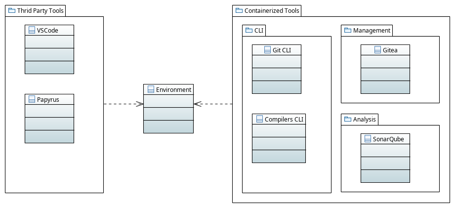
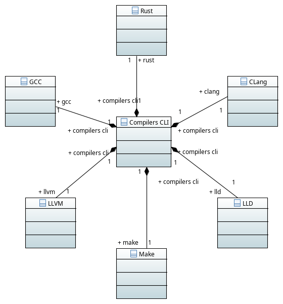

# PatinaBoy Development Environment

Welcome to the PatinaBoy Development Environment.
Its intention is to provide a controllable and isolated environment to develop a Gameboy emulator, avoiding compromising the machine with several versions of libraries and programs.
It uses the [Kubernetes](https://kubernetes.io/), [Kind](https://kind.sigs.k8s.io/) along with a container driver (Ex. [Podman](https://podman.io/)) to create a fully containerized environment with all necessary tools.

Then, it is possible to create highly customizable applications containers and CLIs.
Four containers are created:
- [Gitea](https://hub.docker.com/r/gitea/gitea): To provide a base tool for project management.
- [SonarQube Community Edition](https://hub.docker.com/_/sonarqube): To analyze the quality of the produced code.
- [Git CLI](https://hub.docker.com/r/alpine/git): Base git shell to host the git configuration for each project.
- Compilers CLI: Custom container developed from the official [Rust](https://hub.docker.com/_/rust) image enhanced with others common compiling tools (Ex CLang).

The way those tools are organized is shown in the diagrams bellow:

The folder structure follows below:

    \> tree 
    .
    ├── bin
    │   ├── .env                            # Default scripts environment variables.
    │   ├── .env.sonar.example              # Example for hosting variables for the sonar-scanner tool (Starting point for the ".env.sonar").
    │   ├── 01-build-images.sh              # Script to build container images to be imported in the Kubernetes cluster.
    │   ├── 02-create-cluster.sh            # Create the main Kubernetes cluster.
    │   ├── connect-cluster.sh              # Access the internal shell inside the Kubernetes cluster.
    │   ├── connect-compilers-cli.sh        # Access a shell inside the Compilers CLI.
    │   ├── connect-git-cli.sh              # Access a shell inside the Git CLI.
    │   ├── create_project_folder.sh        # Creates a new git repository inside the "projects_home" folder.
    │   ├── delete-cluster.sh               # Disable/Delete  a running Kubernetes cluster.
    │   └── delete-images.sh                # Clear the previously container images locally created.
    │   ├── papyrus-desktop                 # Symbolic link to the Third party Papyrus Desktop.
    │   ├── sonar-scanner                   # Symbolic link to the Third party Sonar-Scanner.
    │   ├── sonar-scanner_PatinaBoy.sh      # Custom script for scanning project files and generate SonarQube report.
    │   └── vscode                          # Custom script to start the Third party Visual Studio Code.
    ├── cli_homes                           # Home for any necessary CLI $HOME directory.
    │   ├── compilers_home                  # Default $HOME to Compilers CLI.
    │   └── git_home                        # Default $HOME to Git CLI. Responsible to host and default ".gitconfig" and SSL keys.
            └── .ssh
    ├── images
    │   ├── build                           # Host the locally created container images.
    │   ├── dockerfiles                     # Host the building files for the images.
    │   │   └── compilers_cli.dockerfile
    │   │   └── git_cli.dockerfile
    │   └── README.md
    ├── k8s                                 # Host the configuration files responsible for the cluster.
    │   ├── compilers_cli_pod.yaml
    │   ├── git_cli_pod.yaml
    │   ├── gitea_server_pod.yaml
    │   ├── gitea_server_service.yaml
    │   ├── kind_cluster.yaml
    │   ├── sonarqube_server_pod.yaml
    │   └── sonarqube_server_service.yaml
    ├── Progs                              # Host any necessary third party software.
    ├── projects_home                      # Host individual projects folders
    └── storage_homes                      # Provides storage mounting paths to the Kubernetes cluster.
        ├── gitea
        │   ├── config
        │   └── data
        └── sonarqube
            ├── data
            ├── extensions
            └── logs